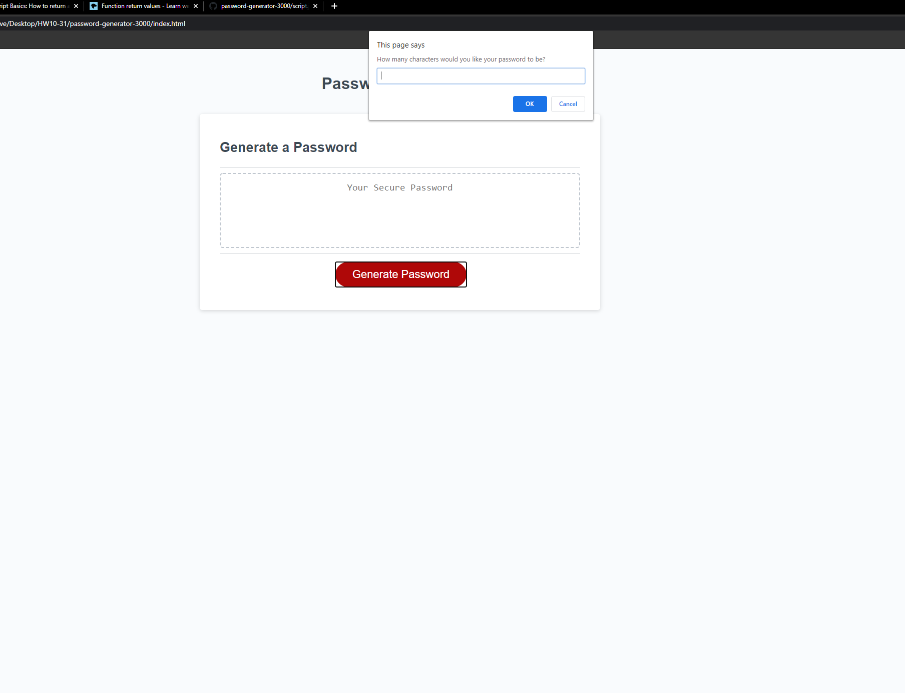
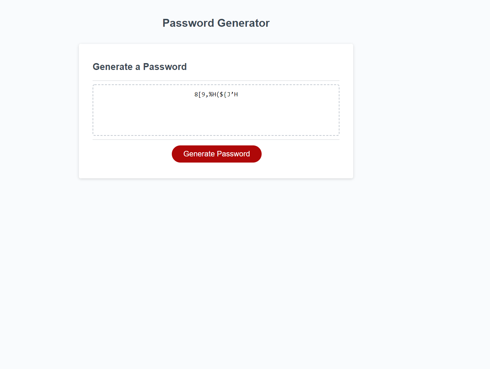

# Password Generator

### Table of Contents

- [Description](#description)
- [Link to Application]()
- [License](#license)

---

---

## Description

This homework was espically humbling this week but still resourceful, at first I had kept geting frustrated with my longer and more clutter filled way of arranging my arrays to use the returning boolean values with the concat() method to put them together, but by doing a little google magic I found a better way to get these values and assinging them to one string and using the setItem method we just learned to implement the string and set the generated password into the passwordText. 

---

## License

MIT License

Copyright (c) [2020] [Austyn Whaley]

Permission is hereby granted, free of charge, to any person obtaining a copy
of this software and associated documentation files (the "Software"), to deal
in the Software without restriction, including without limitation the rights
to use, copy, modify, merge, publish, distribute, sublicense, and/or sell
copies of the Software, and to permit persons to whom the Software is
furnished to do so, subject to the following conditions:

The above copyright notice and this permission notice shall be included in all
copies or substantial portions of the Software.

THE SOFTWARE IS PROVIDED "AS IS", WITHOUT WARRANTY OF ANY KIND, EXPRESS OR
IMPLIED, INCLUDING BUT NOT LIMITED TO THE WARRANTIES OF MERCHANTABILITY,
FITNESS FOR A PARTICULAR PURPOSE AND NONINFRINGEMENT. IN NO EVENT SHALL THE
AUTHORS OR COPYRIGHT HOLDERS BE LIABLE FOR ANY CLAIM, DAMAGES OR OTHER
LIABILITY, WHETHER IN AN ACTION OF CONTRACT, TORT OR OTHERWISE, ARISING FROM,
OUT OF OR IN CONNECTION WITH THE SOFTWARE OR THE USE OR OTHER DEALINGS IN THE
SOFTWARE.

---
[Back To The Top](#Password-Generator)